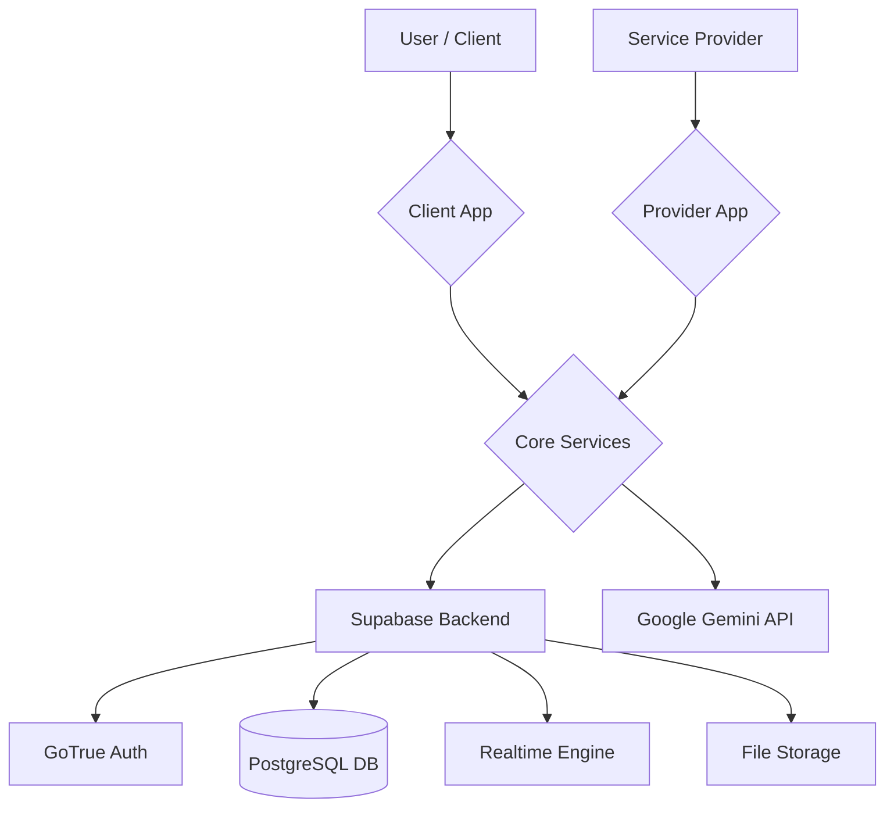

# System Architecture

## Overview

The Lokals Platform is a decentralized service marketplace built on a modern monorepo architecture. It connects local service providers with customers through a seamless, AI-enhanced experience.

### Tech Stack

- **Frontend**: React 18, Vite, Tailwind CSS, Framer Motion
- **Backend**: Supabase (PostgreSQL, Auth, Realtime, Edge Functions)
- **AI**: Google Gemini API (via Supabase Edge Functions)
- **State Management**: React Context, TanStack Query
- **Maps**: Leaflet / Google Maps API
- **Package Manager**: pnpm

## High-Level Architecture

## Monorepo Structure

The project is organized as a monorepo with the following packages:

- **`packages/client`**: The customer-facing web application.
- **`packages/provider`**: The provider-facing web application.
- **`packages/core`**: Shared business logic, types, and API services.
- **`packages/db`**: Database schema and migration scripts.
- **`packages/app`**: (Legacy/Mobile) React Native application code.

## Database Schema

The database is built on PostgreSQL with PostGIS for geospatial features.

### Core Tables

- **`profiles`**: Customer user profiles.
- **`providers`**: Service provider profiles with location and category.
- **`service_categories`**: Master list of available service types.

### Booking System

- **`bookings`**: Central table for all service requests.
- **`live_booking_requests`**: Manages real-time broadcast requests to providers.
- **`booking_otp`**: Secure OTP verification for service start/completion.

### Financials

- **`payment_transactions`**: Records of all payments.
- **`provider_earnings`**: Ledger of provider income and commissions.
- **`offers` & `user_offers`**: Promotional system.

### Compliance & Admin

- **`user_reports`**: UGC moderation system.
- **`account_deletion_requests`**: GDPR/Play Store compliance.
- **`admin_users` & `admin_activity_logs`**: Internal administration.

## Key Systems

### AI-Enhanced Booking
1. User inputs natural language request.
2. Gemini API parses request into structured requirements and checklist.
3. System creates a `bookings` record with `booking_type: 'AI_ENHANCED'`.

### Real-time Provider Matching
1. **Live Booking**: User requests immediate service.
2. `find_nearby_providers` PostGIS function identifies eligible providers.
3. `broadcast_live_booking` creates requests for multiple providers.
4. First provider to accept wins the booking via `accept_live_booking`.

### Security Model
- **RLS (Row Level Security)**: All tables have strict RLS policies ensuring users can only access their own data.
- **Secure RPCs**: Critical business logic (booking creation, payment processing) is encapsulated in `SECURITY DEFINER` PostgreSQL functions.
